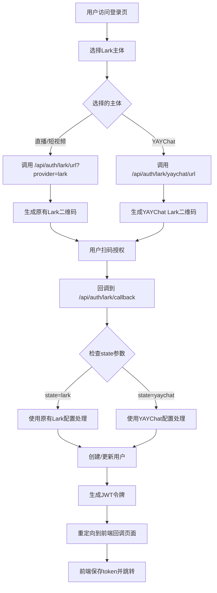

# 前端多Lark主体登录集成指南

## 📋 概述

前端现在支持多个Lark主体的扫码登录，用户可以在登录页面选择不同的Lark应用进行登录。

## 🔧 修改内容

### 1. API方法更新

#### auth.ts API方法
```typescript
// 支持provider参数的Lark登录
export const larkLogin = (code: string, provider?: string) => {
  return request.post<LoginResponse>('/auth/lark/login', { 
    code,
    provider: provider || 'lark'
  })
}

// 支持provider参数的URL获取
export const getLarkAuthUrl = (provider?: string) => {
  const endpoint = provider === 'yaychat' 
    ? '/auth/lark/yaychat/url'
    : `/auth/lark/url${provider ? `?provider=${provider}` : ''}`
  return request.get<{ authUrl: string; provider: string }>(endpoint)
}
```

### 2. Store方法更新

#### auth store中的larkUserLogin
```typescript
const larkUserLogin = async (params: { 
  flag: string; 
  code: string; 
  provider?: string 
}) => {
  // 支持provider参数传递给后端
  const response = await larkLogin(params.code, params.provider)
  // ... 其他逻辑
}
```

### 3. 登录页面更新

#### 动态获取Lark URL
```typescript
const initQR = async () => {
  try {
    // 根据选择的主体获取对应的Lark登录URL
    const provider = larkOrg.value === 'prod' ? 'yaychat' : 'lark'
    
    // 使用前端API方法获取URL
    const { getLarkAuthUrl } = await import('@/api/auth')
    const result = await getLarkAuthUrl(provider)
    
    const authUrl = result.data.authUrl
    // 使用后端返回的完整URL生成二维码
  } catch (error) {
    // 错误处理
  }
}
```

## 🎯 用户体验

### 1. 主体选择界面

用户在登录页面底部可以看到主体选择器：

```
主体选择：[直播/短视频 ▼] 或 [YAYChat ▼]
```

- **直播/短视频**: 使用原有Lark配置 (provider=lark)
- **YAYChat**: 使用YAYChat Lark配置 (provider=yaychat)

### 2. 登录流程

1. **选择主体**: 用户在页面底部选择Lark主体
2. **生成二维码**: 系统根据选择的主体调用对应的后端API获取URL
3. **扫码授权**: 用户使用对应的Lark应用扫码
4. **回调处理**: 系统根据state参数识别主体并完成登录
5. **创建用户**: 为不同主体的用户创建独立账号

### 3. 状态管理

系统会在localStorage中保存以下信息：
- `auth_state`: OAuth状态参数
- `auth_flag`: 前端选择的环境标识
- `auth_provider`: 后端使用的provider类型

## 🔄 OAuth流程图



## 🧪 测试验证

### 1. 测试不同主体的URL生成

在浏览器控制台中测试：

```javascript
// 测试原有Lark URL
fetch('/api/auth/lark/url?provider=lark')
  .then(res => res.json())
  .then(data => console.log('原有Lark URL:', data))

// 测试YAYChat Lark URL
fetch('/api/auth/lark/yaychat/url')
  .then(res => res.json())
  .then(data => console.log('YAYChat URL:', data))
```

### 2. 验证URL差异

**原有Lark URL**:
```
https://passport.larksuite.com/suite/passport/oauth/authorize?client_id=cli_a8d0e7a24eba9029&redirect_uri=http%3A%2F%2Flocalhost%3A5818%2Flogin&response_type=code&scope=openid+profile+email&state=lark
```

**YAYChat Lark URL**:
```
https://passport.larksuite.com/suite/passport/oauth/authorize?client_id=cli_a834f9cacbfb9028&redirect_uri=http%3A%2F%2Flocalhost%3A5818%2Flogin&response_type=code&scope=openid+profile+email&state=yaychat
```

关键差异：
- `client_id` 不同
- `state` 参数不同 (lark vs yaychat)

## 🛡️ 安全考虑

### 1. State验证
- 前端生成的state与后端返回的state保持一致
- 回调时验证state参数防止CSRF攻击

### 2. Provider隔离
- 不同provider创建的用户完全隔离
- 邮箱冲突自动处理

### 3. 错误处理
- 网络异常的友好提示
- 登录失败的自动重试机制

## 📱 移动端适配

登录页面已包含响应式设计，支持移动端访问：

```css
@media (max-width: 480px) {
  .lark-login-container {
    transform: scale(0.9);
  }
}

@media (max-width: 320px) {
  .lark-login-container {
    transform: scale(0.8);
  }
}
```

## ✅ 功能验证

现在前端支持：

1. ✅ **主体选择**: 用户可以选择不同的Lark主体
2. ✅ **动态URL**: 根据选择动态获取对应的授权URL
3. ✅ **二维码生成**: 使用正确的URL生成二维码
4. ✅ **状态管理**: 正确保存和传递provider信息
5. ✅ **错误处理**: 完善的错误提示和重试机制
6. ✅ **用户体验**: 平滑的切换和登录流程

前端多Lark主体登录功能已完全集成！🎊
