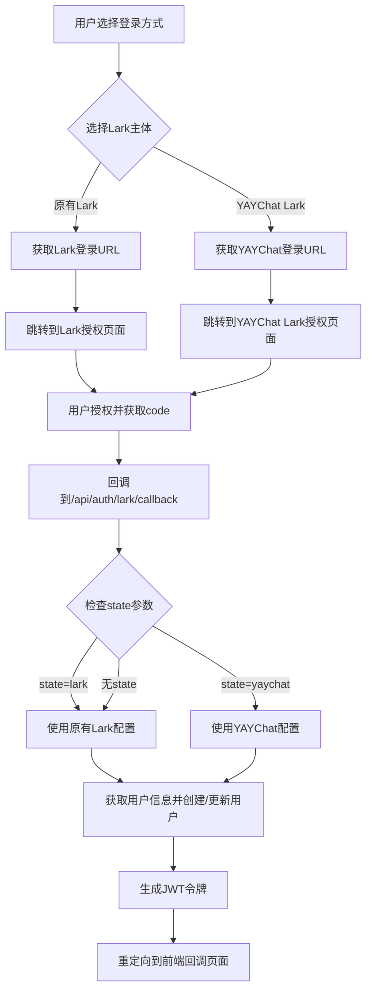

# Lark多主体登录配置指南

## 📋 概述

系统现在支持多个Lark主体配置，允许用户通过不同的Lark应用进行扫码登录。目前支持：

1. **原有Lark主体**: 通用的Lark企业应用
2. **YAYChat Lark主体**: YAYChat专用的Lark应用

## 🔧 环境配置

### .env 文件配置

```bash
# 原有Lark OAuth配置
LARK_APP_ID=cli_a8d0e7a24eba9029
LARK_APP_SECRET=bYlJUBwUVeoQVT2FQrBDQcd7LABItjHQ
LARK_REDIRECT_URI=http://localhost:5818/login

# YAYChat Lark OAuth配置
YAYCHAT_LARK_APP_ID=cli_a834f9cacbfb9028
YAYCHAT_LARK_APP_SECRET=mDcR11uz1Hz6UKZW4ksHce0B6WVCtAR1
YAYCHAT_LARK_REDIRECT_URI=http://localhost:5818/login
```

## 🚀 API 接口

### 1. 获取Lark登录URL（支持多主体）

**接口**: `GET /api/auth/lark/url`  
**参数**: `provider` (可选) - 'lark' | 'yaychat'

```bash
# 获取原有Lark登录URL
curl -X GET "http://localhost:1106/api/auth/lark/url?provider=lark"

# 获取YAYChat Lark登录URL
curl -X GET "http://localhost:1106/api/auth/lark/url?provider=yaychat"

# 默认使用原有Lark
curl -X GET "http://localhost:1106/api/auth/lark/url"
```

**响应示例**:
```json
{
  "code": 200,
  "message": "获取成功",
  "data": {
    "authUrl": "https://passport.larksuite.com/suite/passport/oauth/authorize?client_id=cli_a834f9cacbfb9028&redirect_uri=http%3A%2F%2Flocalhost%3A5818%2Flogin&response_type=code&scope=openid+profile+email&state=yaychat",
    "provider": "yaychat"
  }
}
```

### 2. YAYChat Lark专用URL接口

**接口**: `GET /api/auth/lark/yaychat/url`

```bash
curl -X GET "http://localhost:1106/api/auth/lark/yaychat/url"
```

### 3. Lark扫码登录（支持多主体）

**接口**: `POST /api/auth/lark/login`

```bash
# 使用原有Lark主体登录
curl -X POST http://localhost:1106/api/auth/lark/login \
  -H "Content-Type: application/json" \
  -d '{
    "code": "YOUR_AUTHORIZATION_CODE",
    "provider": "lark"
  }'

# 使用YAYChat Lark主体登录
curl -X POST http://localhost:1106/api/auth/lark/login \
  -H "Content-Type: application/json" \
  -d '{
    "code": "YOUR_AUTHORIZATION_CODE",
    "provider": "yaychat"
  }'
```

### 4. Lark账号绑定（支持多主体）

**接口**: `POST /api/auth/lark/bind`  
**权限**: 需要JWT认证

```bash
# 绑定原有Lark账号
curl -X POST http://localhost:1106/api/auth/lark/bind \
  -H "Authorization: Bearer YOUR_JWT_TOKEN" \
  -H "Content-Type: application/json" \
  -d '{
    "code": "YOUR_AUTHORIZATION_CODE",
    "provider": "lark"
  }'

# 绑定YAYChat Lark账号
curl -X POST http://localhost:1106/api/auth/lark/bind \
  -H "Authorization: Bearer YOUR_JWT_TOKEN" \
  -H "Content-Type: application/json" \
  -d '{
    "code": "YOUR_AUTHORIZATION_CODE", 
    "provider": "yaychat"
  }'
```

### 5. OAuth回调处理

**接口**: `GET /api/auth/lark/callback`  
**参数**: `code` (必需), `state` (可选)

系统会根据 `state` 参数自动识别使用的Lark主体：
- `state=lark`: 使用原有Lark配置
- `state=yaychat`: 使用YAYChat Lark配置
- 无state或其他值: 默认使用原有Lark配置

## 🔍 前端集成

### 1. 获取不同主体的登录URL

```javascript
// 获取原有Lark登录URL
const larkUrl = await fetch('/api/auth/lark/url?provider=lark')
  .then(res => res.json());

// 获取YAYChat Lark登录URL
const yaychatUrl = await fetch('/api/auth/lark/yaychat/url')
  .then(res => res.json());
```

### 2. 前端显示多个登录选项

```vue
<template>
  <div class="lark-login-options">
    <button @click="loginWithLark('lark')" class="lark-btn">
      
      企业Lark登录
    </button>
    
    <button @click="loginWithLark('yaychat')" class="yaychat-lark-btn">
      
      YAYChat Lark登录
    </button>
  </div>
</template>

<script>
export default {
  methods: {
    async loginWithLark(provider) {
      const endpoint = provider === 'yaychat' 
        ? '/api/auth/lark/yaychat/url'
        : `/api/auth/lark/url?provider=${provider}`;
        
      const response = await fetch(endpoint);
      const result = await response.json();
      
      if (result.code === 200) {
        window.location.href = result.data.authUrl;
      }
    }
  }
}
</script>
```

## 🔐 用户识别机制

### 用户名生成规则

不同Lark主体的用户会生成不同前缀的用户名：

```typescript
// 原有Lark用户
username: `lark_${larkUserInfo.sub}`
// 例如: lark_ou_8e2db320f5c1f96ddb3417a29ca2121f

// YAYChat Lark用户 (可以考虑添加特殊前缀)
username: `yaychat_lark_${larkUserInfo.sub}`
// 例如: yaychat_lark_ou_1234567890abcdef
```

### 邮箱冲突处理

当邮箱已存在时，系统会自动生成唯一邮箱：

```typescript
// 原有Lark用户
uniqueEmail = `lark_${larkUserInfo.sub}@lark.matrix.com`

// YAYChat Lark用户
uniqueEmail = `yaychat_lark_${larkUserInfo.sub}@lark.matrix.com`
```

## 📊 测试验证

### 测试不同主体的登录URL

```bash
# 1. 登录系统
TOKEN=$(curl -X POST http://localhost:1106/api/auth/login \
  -H "Content-Type: application/json" \
  -d '{"username": "admin", "password": "admin123"}' \
  | jq -r '.data.accessToken')

# 2. 测试原有Lark URL
curl -X GET "http://localhost:1106/api/auth/lark/url?provider=lark" | jq .

# 3. 测试YAYChat Lark URL
curl -X GET "http://localhost:1106/api/auth/lark/url?provider=yaychat" | jq .

# 4. 测试专用接口
curl -X GET "http://localhost:1106/api/auth/lark/yaychat/url" | jq .
```

### 验证URL差异

从测试结果可以看到：

**原有Lark**:
- `client_id=cli_a8d0e7a24eba9029`
- `state=lark`

**YAYChat Lark**:
- `client_id=cli_a834f9cacbfb9028`
- `state=yaychat`

## 🎯 使用场景

### 1. 企业内部用户
使用原有Lark主体，适合：
- 企业内部员工
- 管理人员
- 需要高权限的用户

### 2. YAYChat相关用户
使用YAYChat Lark主体，适合：
- YAYChat平台用户
- 外部合作伙伴
- 特定业务场景的用户

## 🔄 OAuth流程

### 完整的多主体OAuth流程



## 🛡️ 安全考虑

### 1. 配置隔离
- 每个Lark主体使用独立的APP_ID和APP_SECRET
- 不同主体的用户数据完全隔离
- 支持不同的回调URL配置

### 2. 用户区分
- 通过state参数区分不同的Lark主体
- 用户名前缀区分不同来源
- 邮箱冲突自动处理

### 3. 权限控制
- 新用户默认分配viewer角色
- 可以根据Lark主体分配不同的默认角色
- 支持后续的权限升级

## 🔧 高级配置

### 根据Lark主体分配不同角色

如果需要为不同Lark主体的用户分配不同的默认角色，可以在 `findOrCreateUser` 方法中添加逻辑：

```typescript
// 根据provider分配不同的默认角色
let defaultRoleCode = 'viewer'; // 默认角色

// 如果是通过YAYChat Lark登录，可以分配不同的角色
if (provider === 'yaychat') {
  defaultRoleCode = 'ops'; // 或其他适合的角色
}

const defaultRole = await this.roleRepository.findOne({
  where: { code: defaultRoleCode },
});
```

## ✅ 功能验证

现在系统支持：

1. ✅ **多Lark主体配置**: 原有Lark + YAYChat Lark
2. ✅ **独立用户创建**: 每个Lark用户创建独立账号
3. ✅ **主体识别**: 通过state参数自动识别
4. ✅ **配置隔离**: 不同主体使用不同的认证配置
5. ✅ **前端集成**: 支持前端选择不同的登录方式

Lark多主体登录功能已完全配置完成！🎊
