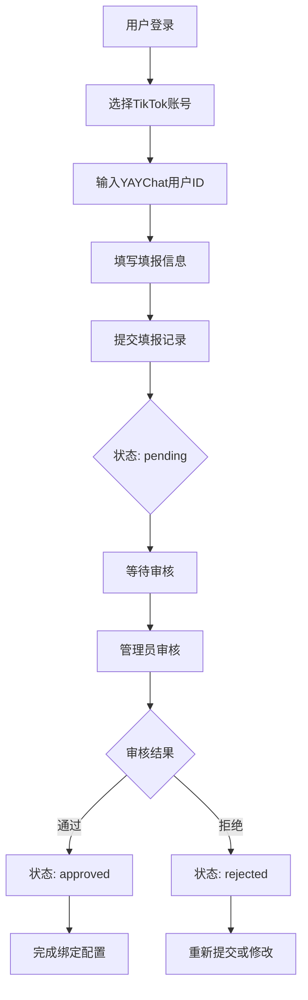
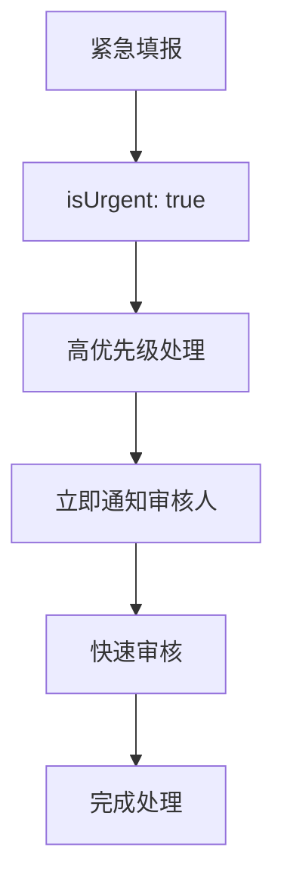

# 填报功能模块使用指南

## 📋 模块概述

填报功能模块用于管理TikTok账号与YAYChat用户ID的关联填报，支持多种填报类型、审核流程和数据统计。

## 🗄️ 数据表结构

### report_submissions 表

| 字段 | 类型 | 说明 |
|------|------|------|
| id | int | 主键ID |
| submitterId | int | 提交人ID（当前登录用户） |
| tiktokAccountId | int | 关联的TikTok账号ID |
| yaychatUserId | bigint | YAYChat平台的用户ID |
| reportType | enum | 填报类型 |
| status | enum | 填报状态 |
| title | varchar(200) | 填报标题 |
| content | text | 填报详细内容 |
| additionalData | json | 附加的JSON数据 |
| reviewerId | int | 审核人ID |
| reviewedAt | timestamp | 审核时间 |
| reviewNotes | text | 审核备注 |
| priority | int | 处理优先级 |
| tags | json | 填报标签 |
| isUrgent | boolean | 是否为紧急填报 |
| expectedCompletionAt | timestamp | 预期完成时间 |
| completedAt | timestamp | 实际完成时间 |

## 📊 枚举定义

### 填报类型 (ReportType)
- `account_binding`: 账号绑定
- `data_report`: 数据报告
- `conversion_report`: 转化报告
- `other`: 其他

### 填报状态 (ReportStatus)
- `pending`: 待处理
- `processing`: 处理中
- `approved`: 已通过
- `rejected`: 已拒绝

## 🚀 API 接口

### 1. 创建填报记录

**接口**: `POST /api/report-submissions`  
**权限**: `conversion:create`

```bash
curl -X POST http://localhost:1106/api/report-submissions \
  -H "Authorization: Bearer YOUR_JWT_TOKEN" \
  -H "Content-Type: application/json" \
  -d '{
    "tiktokAccountId": 1,
    "yaychatUserId": 1780153,
    "reportType": "account_binding",
    "title": "TikTok账号与YAYChat用户绑定申请",
    "content": "申请将TikTok账号与YAYChat用户进行绑定",
    "priority": 1,
    "tags": ["账号绑定", "数据追踪"],
    "isUrgent": false
  }'
```

**响应示例**:
```json
{
  "code": 200,
  "message": "填报记录创建成功",
  "data": {
    "id": 1,
    "submitterId": 1,
    "tiktokAccountId": 1,
    "yaychatUserId": 1780153,
    "reportType": "account_binding",
    "status": "pending",
    "title": "TikTok账号与YAYChat用户绑定申请",
    "createdAt": "2025-09-09T09:52:36.422Z"
  }
}
```

### 2. 查询填报记录列表

**接口**: `GET /api/report-submissions`  
**权限**: `conversion:read`

```bash
# 基本查询
curl -X GET http://localhost:1106/api/report-submissions \
  -H "Authorization: Bearer YOUR_JWT_TOKEN"

# 按状态查询
curl -X GET "http://localhost:1106/api/report-submissions?status=pending&page=1&limit=10" \
  -H "Authorization: Bearer YOUR_JWT_TOKEN"

# 按类型查询
curl -X GET "http://localhost:1106/api/report-submissions?reportType=account_binding" \
  -H "Authorization: Bearer YOUR_JWT_TOKEN"

# 紧急填报查询
curl -X GET "http://localhost:1106/api/report-submissions?isUrgent=true" \
  -H "Authorization: Bearer YOUR_JWT_TOKEN"

# 关键词搜索
curl -X GET "http://localhost:1106/api/report-submissions?keyword=绑定" \
  -H "Authorization: Bearer YOUR_JWT_TOKEN"
```

**查询参数**:
- `page`: 页码 (默认: 1)
- `limit`: 每页数量 (默认: 10)
- `submitterId`: 提交人ID
- `tiktokAccountId`: TikTok账号ID
- `yaychatUserId`: YAYChat用户ID
- `reportType`: 填报类型
- `status`: 填报状态
- `reviewerId`: 审核人ID
- `isUrgent`: 是否紧急
- `keyword`: 搜索关键词
- `startDate`: 开始日期
- `endDate`: 结束日期

### 3. 获取我的填报记录

**接口**: `GET /api/report-submissions/my-reports`  
**权限**: `conversion:read`

```bash
curl -X GET "http://localhost:1106/api/report-submissions/my-reports?status=pending" \
  -H "Authorization: Bearer YOUR_JWT_TOKEN"
```

### 4. 获取填报记录详情

**接口**: `GET /api/report-submissions/:id`  
**权限**: `conversion:read`

```bash
curl -X GET http://localhost:1106/api/report-submissions/1 \
  -H "Authorization: Bearer YOUR_JWT_TOKEN"
```

### 5. 更新填报记录

**接口**: `PATCH /api/report-submissions/:id`  
**权限**: `conversion:update`

```bash
curl -X PATCH http://localhost:1106/api/report-submissions/1 \
  -H "Authorization: Bearer YOUR_JWT_TOKEN" \
  -H "Content-Type: application/json" \
  -d '{
    "title": "更新后的填报标题",
    "content": "更新后的填报内容",
    "priority": 2
  }'
```

### 6. 删除填报记录

**接口**: `DELETE /api/report-submissions/:id`  
**权限**: `conversion:delete`

```bash
curl -X DELETE http://localhost:1106/api/report-submissions/1 \
  -H "Authorization: Bearer YOUR_JWT_TOKEN"
```

### 7. 审核填报记录

**接口**: `POST /api/report-submissions/:id/review`  
**权限**: `conversion:update`

```bash
# 通过审核
curl -X POST http://localhost:1106/api/report-submissions/1/review \
  -H "Authorization: Bearer YOUR_JWT_TOKEN" \
  -H "Content-Type: application/json" \
  -d '{
    "status": "approved",
    "reviewNotes": "审核通过，绑定关系已建立"
  }'

# 拒绝审核
curl -X POST http://localhost:1106/api/report-submissions/1/review \
  -H "Authorization: Bearer YOUR_JWT_TOKEN" \
  -H "Content-Type: application/json" \
  -d '{
    "status": "rejected",
    "reviewNotes": "信息不完整，请重新提交"
  }'
```

### 8. 批量更新状态

**接口**: `POST /api/report-submissions/batch-update-status`  
**权限**: `conversion:update`

```bash
curl -X POST http://localhost:1106/api/report-submissions/batch-update-status \
  -H "Authorization: Bearer YOUR_JWT_TOKEN" \
  -H "Content-Type: application/json" \
  -d '{
    "reportIds": [1, 2, 3],
    "status": "processing",
    "batchNotes": "批量处理中"
  }'
```

### 9. 更新填报状态

**接口**: `PATCH /api/report-submissions/:id/status`  
**权限**: `conversion:update`

```bash
curl -X PATCH http://localhost:1106/api/report-submissions/1/status \
  -H "Authorization: Bearer YOUR_JWT_TOKEN" \
  -H "Content-Type: application/json" \
  -d '{"status": "processing"}'
```

### 10. 根据YAYChat用户ID查询

**接口**: `GET /api/report-submissions/yaychat-user/:yaychatUserId`  
**权限**: `conversion:read`

```bash
curl -X GET http://localhost:1106/api/report-submissions/yaychat-user/1780153 \
  -H "Authorization: Bearer YOUR_JWT_TOKEN"
```

### 11. 根据TikTok账号ID查询

**接口**: `GET /api/report-submissions/tiktok-account/:tiktokAccountId`  
**权限**: `conversion:read`

```bash
curl -X GET http://localhost:1106/api/report-submissions/tiktok-account/1 \
  -H "Authorization: Bearer YOUR_JWT_TOKEN"
```

### 12. 获取统计概览

**接口**: `GET /api/report-submissions/statistics/overview`  
**权限**: `conversion:read`

```bash
curl -X GET http://localhost:1106/api/report-submissions/statistics/overview \
  -H "Authorization: Bearer YOUR_JWT_TOKEN"
```

**响应示例**:
```json
{
  "code": 200,
  "message": "获取成功",
  "data": {
    "total": 50,
    "statusStats": {
      "pending": 15,
      "processing": 10,
      "approved": 20,
      "rejected": 5
    },
    "typeStats": {
      "account_binding": 25,
      "data_report": 15,
      "conversion_report": 8,
      "other": 2
    },
    "urgentCount": 5,
    "todayCount": 8,
    "pendingCount": 15
  }
}
```

## 🔐 权限控制

### 操作权限映射

| 操作 | 权限代码 | 说明 |
|------|----------|------|
| 查看填报 | `conversion:read` | 查看填报记录列表和详情 |
| 创建填报 | `conversion:create` | 创建新的填报记录 |
| 更新填报 | `conversion:update` | 更新填报信息、审核 |
| 删除填报 | `conversion:delete` | 删除填报记录 |

### 数据访问控制

1. **提交权限**: 所有有`conversion:create`权限的用户都可以提交
2. **修改权限**: 只有提交人或管理员可以修改
3. **删除权限**: 只有提交人或管理员可以删除待处理状态的记录
4. **审核权限**: 有`conversion:update`权限的用户可以审核

## 🔄 业务流程

### 1. 标准填报流程



### 2. 紧急填报流程



## 📈 使用示例

### 1. 完整的填报流程

```bash
# 1. 登录获取token
TOKEN=$(curl -X POST http://localhost:1106/api/auth/login \
  -H "Content-Type: application/json" \
  -d '{"username": "admin", "password": "admin123"}' \
  | jq -r '.data.accessToken')

# 2. 查看可用的TikTok账号
curl -X GET http://localhost:1106/api/tiktok-accounts \
  -H "Authorization: Bearer $TOKEN"

# 3. 创建填报记录
curl -X POST http://localhost:1106/api/report-submissions \
  -H "Authorization: Bearer $TOKEN" \
  -H "Content-Type: application/json" \
  -d '{
    "tiktokAccountId": 1,
    "yaychatUserId": 1780153,
    "reportType": "account_binding",
    "title": "账号绑定申请",
    "content": "申请绑定TikTok账号用于数据追踪",
    "tags": ["绑定", "追踪"]
  }'

# 4. 查看填报记录
curl -X GET http://localhost:1106/api/report-submissions/1 \
  -H "Authorization: Bearer $TOKEN"

# 5. 审核填报记录
curl -X POST http://localhost:1106/api/report-submissions/1/review \
  -H "Authorization: Bearer $TOKEN" \
  -H "Content-Type: application/json" \
  -d '{
    "status": "approved",
    "reviewNotes": "审核通过"
  }'

# 6. 查看统计信息
curl -X GET http://localhost:1106/api/report-submissions/statistics/overview \
  -H "Authorization: Bearer $TOKEN"
```

### 2. 批量操作示例

```bash
# 批量审核多个填报
curl -X POST http://localhost:1106/api/report-submissions/batch-update-status \
  -H "Authorization: Bearer $TOKEN" \
  -H "Content-Type: application/json" \
  -d '{
    "reportIds": [1, 2, 3],
    "status": "approved",
    "batchNotes": "批量审核通过"
  }'
```

### 3. 数据查询示例

```bash
# 查询指定YAYChat用户的所有填报
curl -X GET http://localhost:1106/api/report-submissions/yaychat-user/1780153 \
  -H "Authorization: Bearer $TOKEN"

# 查询指定TikTok账号的所有填报
curl -X GET http://localhost:1106/api/report-submissions/tiktok-account/1 \
  -H "Authorization: Bearer $TOKEN"

# 查询我的填报记录
curl -X GET http://localhost:1106/api/report-submissions/my-reports \
  -H "Authorization: Bearer $TOKEN"

# 按日期范围查询
curl -X GET "http://localhost:1106/api/report-submissions?startDate=2025-09-01&endDate=2025-09-30" \
  -H "Authorization: Bearer $TOKEN"
```

## 🎯 业务场景

### 1. TikTok账号绑定场景

```bash
# 运营人员提交账号绑定申请
curl -X POST http://localhost:1106/api/report-submissions \
  -H "Authorization: Bearer $TOKEN" \
  -H "Content-Type: application/json" \
  -d '{
    "tiktokAccountId": 1,
    "yaychatUserId": 1780153,
    "reportType": "account_binding",
    "title": "A级账号绑定申请",
    "content": "申请将A级TikTok账号与高价值YAYChat用户进行绑定",
    "priority": 2,
    "tags": ["A级账号", "高价值用户", "重点追踪"],
    "isUrgent": true
  }'
```

### 2. 转化数据报告场景

```bash
# 分析师提交转化数据报告
curl -X POST http://localhost:1106/api/report-submissions \
  -H "Authorization: Bearer $TOKEN" \
  -H "Content-Type: application/json" \
  -d '{
    "tiktokAccountId": 2,
    "yaychatUserId": 1791650,
    "reportType": "conversion_report",
    "title": "美妆账号转化效果分析",
    "content": "分析美妆账号在过去30天的转化表现和用户行为",
    "additionalData": {
      "conversionRate": 3.5,
      "totalViews": 50000,
      "totalClicks": 1750,
      "totalConversions": 61
    },
    "tags": ["转化分析", "美妆", "月度报告"]
  }'
```

### 3. 数据统计报告场景

```bash
# 运营人员提交数据统计报告
curl -X POST http://localhost:1106/api/report-submissions \
  -H "Authorization: Bearer $TOKEN" \
  -H "Content-Type: application/json" \
  -d '{
    "tiktokAccountId": 3,
    "yaychatUserId": 1365401,
    "reportType": "data_report",
    "title": "美食账号数据表现报告",
    "content": "美食账号的粉丝增长、互动率和内容表现分析",
    "additionalData": {
      "followerGrowth": 1200,
      "engagementRate": 4.2,
      "avgViewsPerVideo": 8500
    },
    "tags": ["数据分析", "美食", "增长报告"]
  }'
```

## 📊 数据统计和分析

### 1. 获取整体统计

```bash
curl -X GET http://localhost:1106/api/report-submissions/statistics/overview \
  -H "Authorization: Bearer $TOKEN" | jq .
```

### 2. 分析填报趋势

```bash
# 查询最近7天的填报
curl -X GET "http://localhost:1106/api/report-submissions?startDate=2025-09-02&endDate=2025-09-09" \
  -H "Authorization: Bearer $TOKEN" \
  | jq '.data.reports | group_by(.reportType) | map({type: .[0].reportType, count: length})'
```

### 3. 审核效率分析

```bash
# 查询已审核的记录
curl -X GET "http://localhost:1106/api/report-submissions?status=approved" \
  -H "Authorization: Bearer $TOKEN" \
  | jq '.data.reports[] | {id, title, createdAt, reviewedAt, reviewer: .reviewer.nickname}'
```

## 🔍 查询和筛选

### 高级查询示例

```bash
# 查询特定用户的紧急填报
curl -X GET "http://localhost:1106/api/report-submissions?submitterId=2&isUrgent=true" \
  -H "Authorization: Bearer $TOKEN"

# 查询待处理的账号绑定申请
curl -X GET "http://localhost:1106/api/report-submissions?reportType=account_binding&status=pending" \
  -H "Authorization: Bearer $TOKEN"

# 查询高优先级的填报
curl -X GET http://localhost:1106/api/report-submissions \
  -H "Authorization: Bearer $TOKEN" \
  | jq '.data.reports[] | select(.priority >= 2)'
```

## 🚨 错误处理

### 常见错误及解决方案

1. **TikTok账号不存在**
   - 确认TikTok账号ID是否正确
   - 检查账号是否已被删除

2. **重复填报**
   - 系统会检查是否存在相同的待处理记录
   - 避免重复提交相同的绑定申请

3. **权限不足**
   - 检查用户是否有相应的权限
   - 确认操作类型是否匹配权限要求

4. **状态限制**
   - 只有pending状态的记录可以删除
   - 已审核的记录修改受限

## 🎯 最佳实践

### 1. 填报标题规范
- **账号绑定**: "TikTok账号[@username]与YAYChat用户[ID]绑定申请"
- **转化报告**: "[账号名称]转化效果分析报告"
- **数据报告**: "[账号名称][时间段]数据统计报告"

### 2. 内容描述建议
- 详细说明填报目的和背景
- 提供必要的数据支撑
- 明确预期结果和时间要求

### 3. 标签使用规范
- 使用统一的标签体系
- 包含业务类型、紧急程度、处理状态等
- 便于后续查询和统计分析

### 4. 优先级设置
- **0**: 普通优先级
- **1**: 中等优先级
- **2**: 高优先级
- **3+**: 最高优先级

## ✅ 测试验证

从测试结果可以看到：

1. ✅ **创建成功**: 3个不同类型的填报记录
2. ✅ **关联正确**: TikTok账号和YAYChat用户ID正确关联
3. ✅ **审核流程**: 审核功能正常工作
4. ✅ **查询功能**: 支持多种查询方式
5. ✅ **统计准确**: 实时统计数据正确

填报功能模块已完全就绪，可以支撑完整的业务流程！🎊
